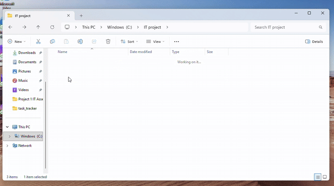

# Python CLI Task Tracker

A command-line task management application built in Python.

## Features
- Add tasks with assigned user, priority, and due date
- View tasks
- Mark tasks as completed
- Persistent storage using JSON

## Demo

